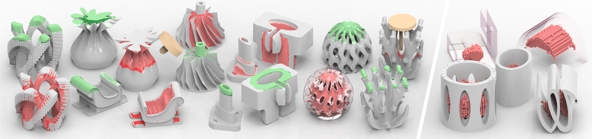

# DeepMill: Neural Accessibility Learning for Subtractive Manufacturing (Jittor)

[**DeepMill: Neural Accessibility Learning for Subtractive Manufacturing**](https://arxiv.org/abs/2309.05613)  
[Fanchao Zhong](https://fanchao98.github.io/),
[Yang Wang](https://chfaithwy.github.io/),
[Peng-Shuai Wang](https://wang-ps.github.io/),
[Lin Lu](https://irc.cs.sdu.edu.cn/~lulin/index.html), and
[Haisen Zhao](https://haisenzhao.github.io/)  
ACM SIGGRAPH 2025 (conference track)



This directory is the **Jittor port** of DeepMill used by DeepMill++. It keeps
the original O-CNN architecture, data format, training driver, and pretrained
weights while replacing the PyTorch runtime with Jittor. The easiest way to
predict a new OBJ is the `predict_visibility.py` entry point in the parent
directory.

## Contents

- [1. Environment configuration](#1-environment-configuration)
- [2. Predict an OBJ with the pretrained network](#2-predict-an-obj-with-the-pretrained-network)
- [3. Prepare a training dataset](#3-prepare-a-training-dataset)
- [4. Train](#4-train)
- [5. Test a prepared dataset](#5-test-a-prepared-dataset)
- [6. Output convention](#6-output-convention)
- [7. Troubleshooting and limitations](#7-troubleshooting-and-limitations)
- [8. Citation](#8-citation)

## 1. Environment configuration

Use Ubuntu Linux with Python 3.10 or 3.11 and a C++ compiler. From the
DeepMill++Jittor root directory:

```bash
conda create -n deepmill-jittor python=3.10 -y
conda activate deepmill-jittor

cd /path/to/DeepMill++Jittor
python -m pip install --upgrade pip
pip install -r requirements.txt
```

The parent requirements file includes Jittor and all DeepM dependencies. If
DeepM is used as a standalone folder, install its smaller dependency list:

```bash
cd DeepM
pip install -r requirements.txt
```

Verify the installation:

```bash
python -c "import jittor as jt; print('Jittor', jt.__version__, 'CUDA:', jt.has_cuda)"
```

Jittor compiles operators on their first use. A first run is therefore slower
than later runs. Single-process CPU and single-GPU execution are supported;
multi-process distributed training is not supported by this port.

The pretrained checkpoint must be available at:

```text
DeepM/pretrained/deepm_00100.model.pth
```

The checkpoint is not included in this source-only repository. Download it
before inference:

```bash
mkdir -p DeepM/pretrained
curl -L --fail \
  -o DeepM/pretrained/deepm_00100.model.pth \
  https://raw.githubusercontent.com/YaoZhang-666/DeepMillPlusPlus/main/DeepM/pretrained/deepm_00100.model.pth
```

See `pretrained/README.md` for the expected file name.

## 2. Predict an OBJ with the pretrained network

This is the recommended inference workflow for new users. Run it from the
DeepMill++Jittor root, not from `DeepM/projects`:

```bash
cd /path/to/DeepMill++Jittor

python predict_visibility.py \
  --mesh examples/done/dcSim/dcSim.obj \
  --checkpoint DeepM/pretrained/deepm_00100.model.pth \
  --output examples/done/dcSim/deepm_inaccessible_matrix.txt \
  --probabilities examples/done/dcSim/deepm_inaccessible_probabilities.txt \
  --tool-params 1.5 20 15 30
```

The script performs the preprocessing expected by the checkpoint:

1. loads the OBJ without reordering vertices;
2. computes one normal per vertex;
3. mean-centers and scales coordinates into `[-0.8, 0.8]`;
4. builds a depth-5 octree with `NDP` input features;
5. runs the 102-output UNet and applies a sigmoid threshold of 0.5.

`--tool-params` supplies the four cutter-conditioning values. The default is
`1.5 20 15 30`, so the argument may be omitted for the supplied example. Use
`--threshold VALUE` to change the binary threshold. Omit `--probabilities` when
only the binary output is required.

The binary result has shape `102 × N`, where `N` is the OBJ vertex count and
`1` means **inaccessible** for that point and direction.

To continue into DeepMill++, convert this convention and run rasterization:

```bash
python prepare_visibility_matrix.py \
  --input examples/done/dcSim/deepm_inaccessible_matrix.txt \
  --mesh examples/done/dcSim/dcSim.obj \
  --output examples/done/dcSim/visibility_matrix.txt

python deepmill2.py \
  --model dcSim \
  --output-root outputs/rendering_network_prediction
```

See the [parent README](../README.md) for the full DeepMill++ workflow and
output interpretation.

## 3. Prepare a training dataset

The dataset runner uses the following layout:

```text
DeepM/projects/data/
├── raw_data/
│   ├── models/
│   │   ├── sample_001.txt
│   │   └── ...
│   └── models_cutter/
│       ├── sample_001_cutter.txt
│       └── ...
├── points/                   # generated
│   └── models/
└── filelist/                 # generated
    ├── models_train_val.txt
    └── models_test.txt
```

Each row of a raw model TXT contains:

```text
x y z nx ny nz direction_label_0 ... direction_label_101 occlusion_label
```

Thus each row describes one point with 3 coordinates, 3 normal components,
102 binary directional inaccessibility labels, and one auxiliary occlusion
label. Each matching cutter TXT contains four floating-point values:

```text
1.5 20 15 30
```

File stems must match. For example, `models/sample_001.txt` pairs with
`models_cutter/sample_001_cutter.txt`.

From `DeepM/projects`, preprocess and create an 80/20 train/test split:

```bash
cd /path/to/DeepMill++Jittor/DeepM/projects
python tools/seg_deepmill_cutter.py --run prepare_dataset --sr 0.8
```

Important details:

- Do not omit `--sr 0.8`: the script default is `0`, which puts every sample
  into the test list and leaves the training list empty.
- Preprocessing normalizes and overwrites TXT files under
  `data/raw_data/models`. Keep a backup of the original raw data.
- Successful preprocessing creates `data/points/models` and `data/filelist`.

Before training, confirm that both generated lists contain entries:

```bash
wc -l data/filelist/models_train_val.txt data/filelist/models_test.txt
```

## 4. Train

Training is configured in `projects/configs/seg_deepmill.yaml`. Before starting,
set:

```yaml
SOLVER:
  gpu: 0,
  run: train
```

The trailing comma in `gpu: 0,` represents a one-device tuple and should be
kept. Also check that the generated file names are
`data/filelist/models_train_val.txt` and `data/filelist/models_test.txt`.

Start training from `DeepM/projects`:

```bash
python run_seg_deepmill.py --depth 5 --model unet --alias unet_d5 --ratios 1
```

Training logs and checkpoints are written below:

```text
DeepM/projects/logs/seg_deepmill/unet_d5/
```

To resume or initialize from a checkpoint:

```bash
python run_seg_deepmill.py \
  --depth 5 \
  --model unet \
  --alias unet_d5 \
  --ckpt ../pretrained/deepm_00100.model.pth
```

The UNet has approximately 159 million parameters. GPU training requires
substantial memory; reduce `DATA.train.batch_size` in the YAML file if needed.
The training runner calls `.cuda()` and therefore requires a working
Jittor/CUDA setup. Multi-GPU distributed training is not implemented.

View TensorBoard-compatible logs with:

```bash
tensorboard --logdir logs
```

If the `tensorboard` executable is unavailable, install it explicitly with
`pip install tensorboard` or inspect the generated CSV log files directly.

## 5. Test a prepared dataset

Testing through the historical dataset runner requires the PLY data and test
filelist created in Section 3. Set the YAML mode back to:

```yaml
SOLVER:
  gpu: 0,
  run: test
```

Then run:

```bash
cd /path/to/DeepMill++Jittor/DeepM/projects
python run_seg_deepmill.py \
  --depth 5 \
  --model unet \
  --alias unet_d5_test \
  --ckpt ../pretrained/deepm_00100.model.pth
```

Predicted directional matrices are written to:

```text
DeepM/projects/visual/direction/model_name.txt
```

Other visual outputs and inference timings are written below
`DeepM/projects/visual/`.

For a single OBJ that has no labels or PLY file, use the simpler
`predict_visibility.py` workflow in Section 2.

## 6. Output convention

The network produces one probability for every point/direction pair:

- shape before export: `N × 102`;
- exported direction matrix: `102 × N`;
- binary threshold: probability greater than `0.5`;
- DeepM label `1`: inaccessible;
- DeepM label `0`: accessible.

DeepMill++ uses the opposite matrix convention (`1 = allowed`). Always convert
DeepM output with `prepare_visibility_matrix.py`; do not rename the raw DeepM
matrix directly to `visibility_matrix.txt`.

## 7. Troubleshooting and limitations

### Jittor or compiler errors

Confirm that the Conda environment is active and that `g++ --version` works.
Jittor compilation is expected on the first run. For `GLIBCXX_*` errors, update
`libstdcxx-ng` in Conda as described in the parent README.

### CUDA errors

Check:

```bash
nvidia-smi
python -c "import jittor as jt; print(jt.has_cuda)"
```

Direct OBJ inference can be forced to CPU with:

```bash
nvcc_path="" python predict_visibility.py --mesh INPUT.obj --output OUTPUT.txt
```

The historical training/test runner requires CUDA because it explicitly moves
the model and batches to the GPU.

### Empty dataset or missing filelist

Rerun preprocessing with a nonzero split ratio, for example `--sr 0.8`, and
verify the two filelists with `wc -l` before training.

### Checkpoint mismatch

Use `--model unet --depth 5`; the supplied checkpoint is not compatible with
the default `segnet`/4-output values shown in the base YAML before command-line
overrides.

### Port limitations

- Single-process execution only.
- No PyTorch or PyTorch3D dependency.
- The local Jittor O-CNN implementation under `projects/ocnn` is required; do
  not replace it with the unrelated PyPI `ocnn` package.

## 8. Citation

If you find this project useful, please cite the DeepMill paper:

```bibtex
@inproceedings{zhong2025deepmill,
  title={DeepMill: Neural Accessibility Learning for Subtractive Manufacturing},
  author={Zhong, Fanchao and Wang, Yang and Wang, Peng-Shuai and Lu, Lin and Zhao, Haisen},
  booktitle={Proceedings of the Special Interest Group on Computer Graphics and Interactive Techniques Conference Conference Papers},
  pages={1--11},
  year={2025}
}
```

Questions about the original DeepMill project may be sent to
*fanchaoz98@gmail.com*.
